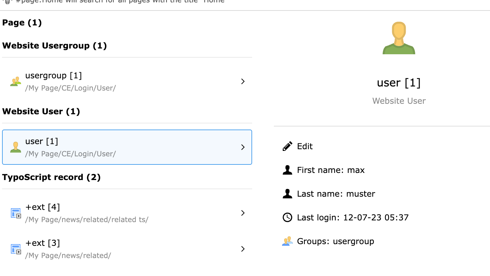
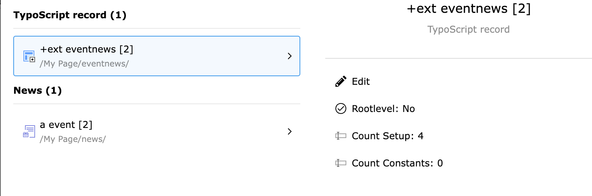
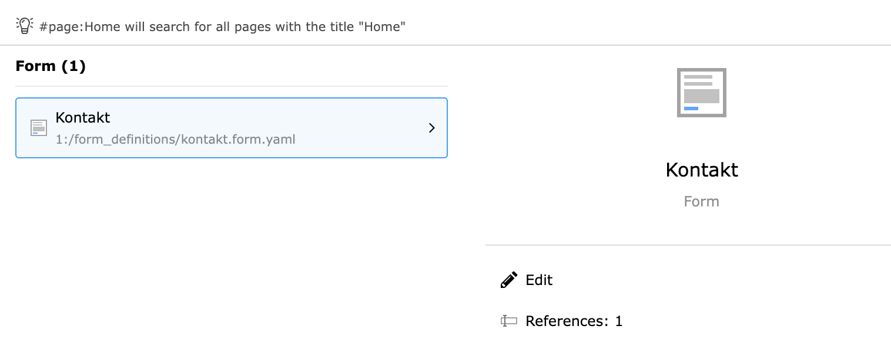

# TYPO3 Extension `live_search_extended`

[](https://get.typo3.org/version/12)






This extension improves the output of TYPO3's backend search of the top right corner which is called **Live Search** by:

- Appending the UID of the record to the title
- Provide more information about the record in the result
- Search for EXT:form records (upcoming version)

Supported TYPO3 versions:

- 12.4 LTS

### Installation
```console
composer require studiomitte/live-search-extended
```

### Usage

Check out the examples in `Configuration/TCA/Overrides/examples.php` which are enabled by default but can be disabled in the Extension settings.

There are 2 ways to configure the extension. Every configuration must be placed in `Configuration/TCA/Overrides/<some_file_name.php`.

#### API driven

```php
$configuration = new \StudioMitte\LiveSearchExtended\Configuration\Table('tx_news_domain_model_news');
        $configuration
            // Provide the field name and an icon identifier
            ->addField(
                (new \StudioMitte\LiveSearchExtended\Configuration\Field('datetime', 'actions-clock'))
                    ->setSkipIfEmpty(true)
                    ->setPrefixLabel(false)
            )
            ->addField(
                (new \StudioMitte\LiveSearchExtended\Configuration\Field('teaser', 'actions-document'))
                    ->setSkipIfEmpty(true)
                    ->setPrefixLabel(false)
            )
            ->persist();
```

### Directly in TCA

```php
$GLOBALS['TCA']['sys_category']['ctrl']['live_search_extended'] = [
    'fields' => [
        'parent' => [
            'icon' => 'mimetypes-x-sys_category',
        ],
    ],
];
```

### Extending

You can provide computed fields in the result row by using the event `\StudioMitte\LiveSearchExtended\Event\ModifyRowEvent`. 
One example is in `\StudioMitte\LiveSearchExtended\EventListener\RowModification\SysTemplateRowModificationEventListener` 
which provides the line count of TypoScript to the result row which is then later used in the configuration

```php
$GLOBALS['TCA']['sys_template']['ctrl']['live_search_extended'] = [
    'fields' => [
        // _count_constants is a computed field
        '_count_constants' => [
            'icon' => 'form-number',
            // As the label can't be taken from TCA as the field is not there provided, a custom label can be set
            'label' => 'Count Constants',
            'skipIfEmpty' => false,
        ],
    ],
];
```


## Credits

This extension was created by [Studio Mitte](https://studiomitte.com) with ♥.

[Find more TYPO3 extensions we have developed](https://www.studiomitte.com/loesungen/typo3) that provide additional features for TYPO3 sites.
